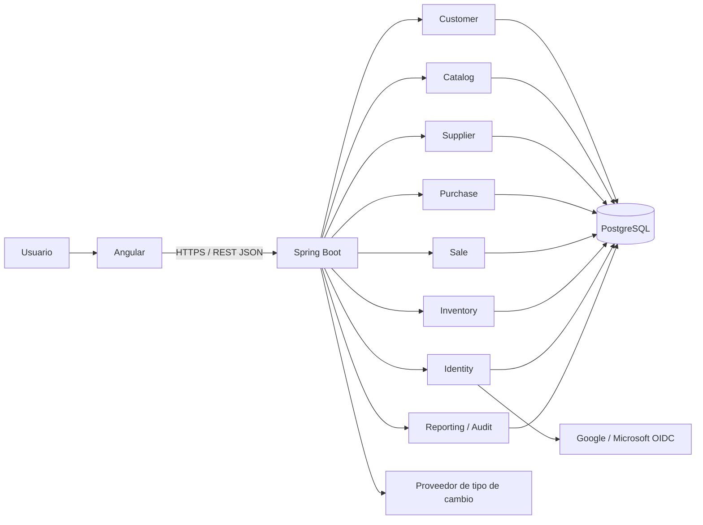
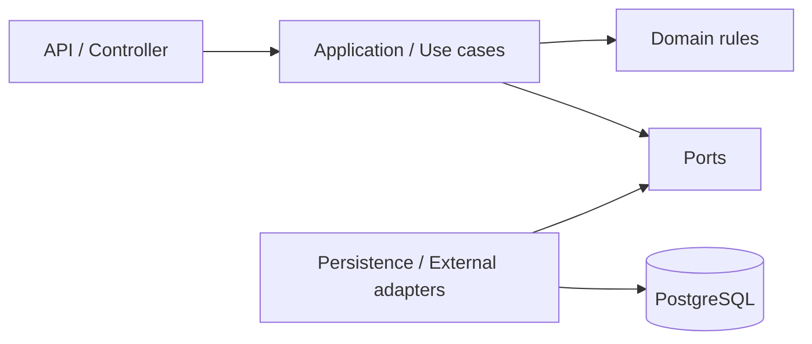
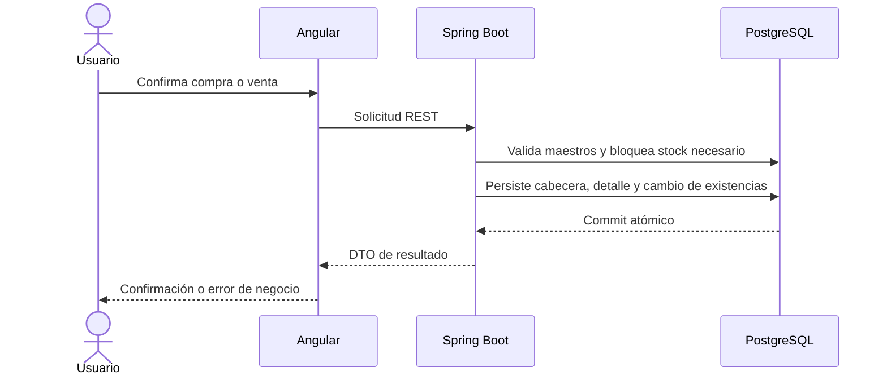

# Visión de arquitectura

## Contexto

Gestión Comercial será una aplicación web interna para administrar el ciclo básico de clientes, catálogo, proveedores, compras, ventas e inventario. Se construirá para una carga de portafolio, no como plataforma multitenant ni como ERP completo.

## Estilo elegido

Se utilizará un monolito modular. Habrá un único despliegue de backend y una única base PostgreSQL, pero el código se dividirá en módulos de dominio con responsabilidades y dependencias explícitas.

Las conexiones hacia el proveedor de cambio y los proveedores OIDC no existirán hasta sus fases respectivas.

## Capas internas de un módulo

No todos los módulos necesitarán una arquitectura ceremonial completa. Se conservará la dirección de dependencias y se añadirá abstracción únicamente cuando proteja reglas o integraciones.

## Flujo comercial principal

## Principios

- Backend como autoridad de reglas, importes, stock y permisos.
- Entidades persistentes no se exponen directamente por REST.
- Un módulo no accede a las tablas de otro evitando su contrato de aplicación.
- Las transacciones terminan en el backend; Angular nunca coordina consistencia de base de datos.
- Configuración externa por ambiente y secretos fuera de Git.
- Complejidad introducida por necesidad demostrable, no por anticipación.

## Ambientes previstos

| Ambiente | Propósito | Datos |
|---|---|---|
| local | desarrollo interactivo | ficticios y descartables |
| test | pruebas automatizadas | aislados por ejecución |
| production | demostración desplegada | controlados; nunca volcados a Git |

## Responsabilidad compartida futura

La aplicación será responsable de validación, autorización, migraciones, logs útiles, métricas y health checks. La plataforma será responsable del runtime, red administrada, terminación TLS y disponibilidad de los servicios contratados. Backups, restauración y alertas deberán verificarse; no se asumirán solo porque exista un servicio administrado.

