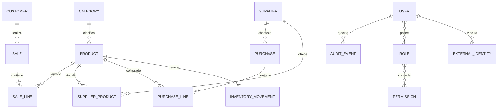

# Modelo conceptual inicial

Este modelo orienta el roadmap; no es todavía un esquema físico ni una migración.

## Agregados previstos

- Customer, Category, Product y Supplier son maestros con estado activo/inactivo.
- Purchase y Sale son raíces con líneas privadas; los importes confirmados quedan como snapshot.
- Inventory mantiene saldo y movimientos; compras/ventas no modifican tablas de inventario directamente desde V9.
- User recibe Role y Permission; ExternalIdentity solo representa el vínculo OIDC.
- AuditEvent es inmutable desde la aplicación.

## Convenciones futuras

- PK interna `BIGINT` generada; referencias de negocio separadas y únicas.
- Importes `NUMERIC` con escala explícita, nunca `float` o `double`.
- Instantes con zona/UTC según capacidad de PostgreSQL y mapeo Java.
- FK, `NOT NULL`, `UNIQUE` y `CHECK` complementan la validación de aplicación.
- Los índices se justifican por consultas conocidas; no se crean indiscriminadamente.

## Evolución controlada

V3 realizó el spike mínimo de persistencia. V4 estableció el baseline de Flyway y cambió Hibernate a validación de esquema. Cada fase posterior añadirá una migración hacia adelante y una estrategia de compatibilidad cuando sea necesaria.

V5 concreta Category y Product como maestros separados. Cada Product pertenece obligatoriamente a una Category y conserva un precio de venta vigente, positivo y expresado en PEN mediante un decimal de escala explícita. Los importes transaccionales futuros seguirán siendo snapshots propios de compras y ventas.

V6 concreta Supplier como maestro y `SUPPLIER_PRODUCT` como asociación única entre proveedor y producto. La asociación conserva estado lógico y un código opcional propio del proveedor; los precios de compra e importes históricos permanecen fuera hasta V7.
